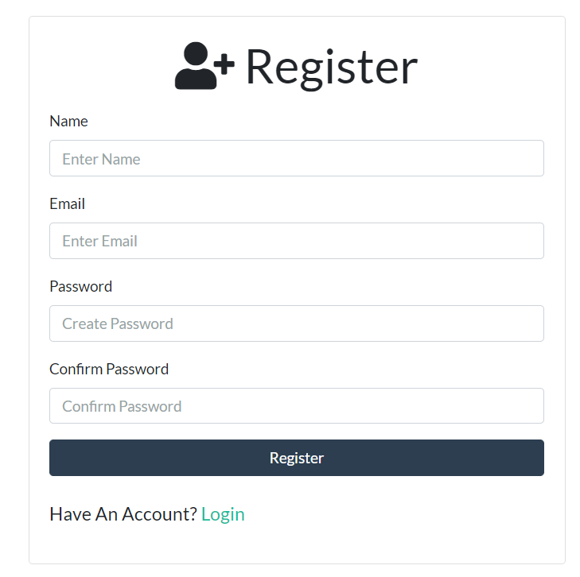
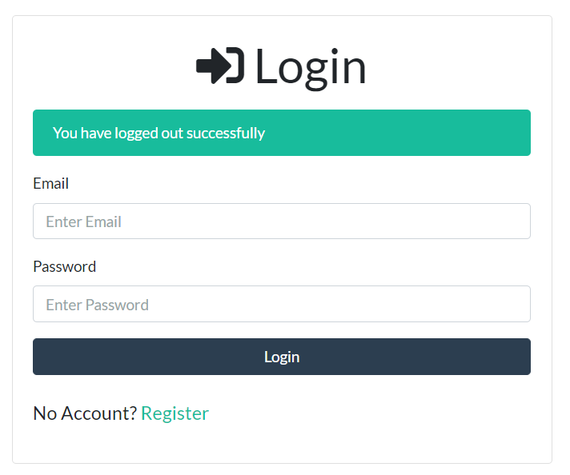
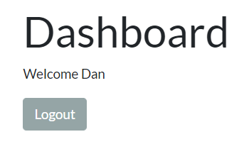

# PHP Login Auth Project

Sign up:

Log in:

Access protected route:

To use this project:

1. Clone this repo
2. Import the `users.sql` db
3. Create `.env` in root and add your db credentials
4. Run `composer i` to install dependencies
